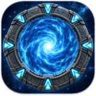

# Gatefall

Long ago a ship crashed on Earth by accident. It carried a gate, and a datachip in the wreck held three addresses. Earth was never meant to be found, and the Dominion don't know it exists. Yet.

**Build the base.** Dig rooms out of the rock, power them and staff them. Scientists study what your teams bring home, engineers turn it into weapons, armour and probes, and every room costs upkeep. Keep the books balanced or the base starves.

**Step into the unknown.** A probe sent through the gate might pick up movement, a structure or an energy signature. It won't tell you what's waiting. Your team finds that out when they walk out on the other side: a settlement, a garrison or an empty ruin. Fight, or slip back through the gate. Linger too long on a quiet world and the gate opens behind you.

**Fight smart.** Cover, flanking and overwatch. The enemy take cover too, pick off the wounded and lob grenades at a squad that bunches up. Walk into their line of sight and they may react before you finish moving. Recruit fighters from allied worlds, each with their own gear and skills: the Warder's shield bash and charge, the Hunter's poisoned arrows, the Seer's foresight.

**Chart the stars.** Every world you reach and every glyph fragment you recover sharpens your star chart. Piece together addresses nobody gave you, and the network opens up one world at a time.

**Stay hidden.** Every time the Dominion catch you, they get a little closer to finding Earth.

## Download

Download the launcher for your computer. It installs the game, keeps it up to date, and still starts it when you are offline.

| Computer | Launcher |
|---|---|
| Steam Deck and Linux (x86-64) | [Gatefall-Launcher-linux-x86_64](https://github.com/dripster82/gatefall-releases/releases/latest/download/Gatefall-Launcher-linux-x86_64) |
| Mac (Apple silicon) | [Gatefall-Launcher-macos-arm64.dmg](https://github.com/dripster82/gatefall-releases/releases/latest/download/Gatefall-Launcher-macos-arm64.dmg) |

All versions are on the [Releases](https://github.com/dripster82/gatefall-releases/releases) page. Windows and Intel Mac builds are not available yet.

## Steam Deck

1. Hold the power button and choose **Switch to Desktop**.
2. Download the Linux launcher (above) with the browser. It lands in **Downloads**.
3. In the file manager, right-click the launcher → **Properties** → **Permissions** → tick **Is executable** → **OK**.
4. Right-click it again → **Add to Steam**.
5. Go back to Game Mode (the **Return to Gaming Mode** icon on the desktop).
6. In your Library, open Gatefall → the controller icon → pick the **Keyboard and Mouse** template. The trackpad moves the pointer and the triggers click.
7. Play. The first start downloads the game, so be online for it. In the game, open **Settings** and turn on **Fullscreen**.

## Linux

Download the launcher, make it executable (`chmod +x Gatefall-Launcher-linux-x86_64`) and run it. You can also add it to Steam as a non-Steam game, as above.

## Mac

Open the dmg and drag **Gatefall** into **Applications**, then start it from there. The launcher and the game are signed and notarized by Apple.

## Saves and updates

- Each time it starts, the launcher checks for a new version, downloads it with a progress bar, checks it, and starts the game. Press **Esc** during a download to skip it and play the version you have.
- The previous version is kept on disk in case a new one has a problem.
- Saves and settings are kept apart from the game files and are never touched by an update: `~/.local/share/gatefall/` on Linux, the Steam Deck and the Mac. The game files are in its `game/` folder.
- To uninstall, delete the launcher and `~/.local/share/gatefall/game`. Delete the whole `~/.local/share/gatefall` folder to remove your saves too.

## Status

Early and in active development. Expect balance changes between versions.
